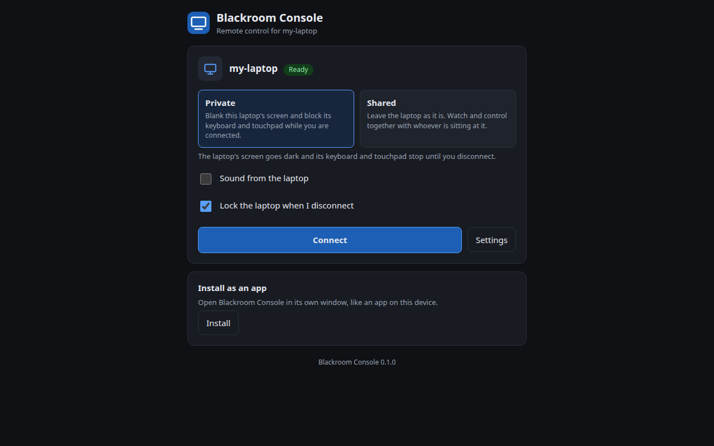
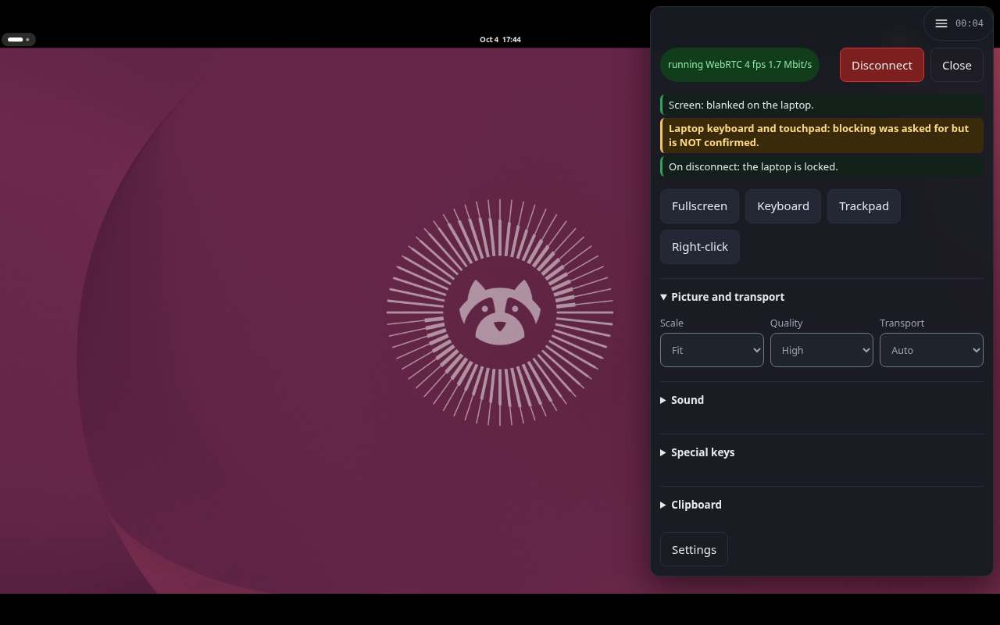

# Blackroom Console

Use a browser on a tablet or phone to see and drive a GNOME laptop, while the laptop's own screen can be blank and its built-in
keyboard and touchpad blocked. One owner, one laptop, one controller at a time. **A technical preview, not a product.**



## Status and what is supported

Version 0.1.0, a narrowly supported technical preview. The authoritative table (what was tested, what was not, what cannot work)
is at the top of [docs/ops/compatibility-matrix.md](docs/ops/compatibility-matrix.md). In short:

| Tested (owner-reported runs kept without logs, plus headless suites) | Not tested | Unsupported |
|---|---|---|
| Ubuntu 26.04, GNOME 50 on Wayland, PipeWire 1.6, NVIDIA with NVENC, the built-in panel as the only output | Other distributions, GNOME 49 or 51, AMD and Intel GPUs, the software H.264 encoder in a live session | X11, other desktops, more than one output |
| Chrome on an Android tablet | **Safari and iOS (waived, untested)**, Firefox | |
| **Private VPN (Tailscale), phone on mobile data**; **Direct with a static IP**: own domain + Let's Encrypt (secure connection, mobile data) and the console's own certificate (20+ minutes) | certificate renewal, other VPNs, a relayed path | |
| | A soak of any length, laptop sleep, start at login, certificate renewal | |

## How it works and what it does to your laptop

- **Private** sessions blank the laptop's panel (a virtual monitor takes over) and a small daemon grabs the built-in keyboard and
  touchpad. **Shared** sessions leave both alone.
- Ending a session (Disconnect, a silent browser, an owner limit) restores the display, locks the laptop when the session's lock
  setting is on, and releases the grab. A failed step is reported as a warning, never as success.
- **Emergency chord:** hold Left Ctrl + Left Shift + Left Alt + Esc on the laptop for 2 seconds. It works only while the keyboard
  grab is held, releases it, ends the session, and closes every remote login until you clear the stop marker at the laptop. It does
  not lock the screen by itself. Everything else that can go wrong, and the SSH fallback: [docs/ops/emergency-recovery.md](docs/ops/emergency-recovery.md).
  SSH is the backup, never the only way out.
- In a running session **F8** opens the page's menu (it is never sent to the laptop).
- Login is the Linux password (PAM) + an authenticator code + a Remote Access Key or a trusted browser, with rate limits.
- Outside the home network, three choices: **Home only** (the default), **Private VPN (recommended)** and **Direct** (riskier,
  untested). `blackroom internet` walks through them. See [docs/ops/internet-access.md](docs/ops/internet-access.md).



*A headless test Shell: the keyboard line says "NOT confirmed" because a headless run has no grab. On the real laptop it reads "blocked".*

## Install and first use

Build the package (needs the Rust toolchain in `rust-toolchain.toml`, `dpkg-deb`, and the GStreamer and PipeWire development headers), then install it:

```
cargo build --release --workspace
docs/ops/build-deb.sh
sudo apt install ./target/deb/blackroom-console_0.1.0-1_amd64.deb
```

Everything after that is done in the pages, step by step:

1. Open **Blackroom Console** from the applications menu. It starts the console (starting it always switches on the top-bar icon) and opens the **Host settings** page; sign in with your laptop password. A **First steps** card lists what is left.
2. **Set up sign-in:** press "Set up the login authority". It creates your authenticator (a QR code to scan), a Remote Access Key and recovery codes, shown once. Keep them in a password manager.
3. **Allow keyboard blocking:** press the button under "Keyboard blocking" and answer the password dialog on the laptop. It is needed once per boot, and only for Private sessions.
4. **Connect:** open the address the First steps card names on the tablet or phone, sign in with your password, an authenticator code and the key, and press Connect.
5. **Outside your home:** under "Access from outside" pick Private VPN (recommended) or Direct; the page checks what you enter and lists the router forwards. Ports are plain numbers there and can be changed if another program uses them.

Nothing is enabled or started by installing the package. A terminal is never required, but `blackroom setup`, `blackroom internet` and `sudo blackroom-grant-input grant` do the same things. Day-to-day use, the reset levels and every recovery step: [docs/ops/runbook.md](docs/ops/runbook.md).

**Update:** install the newer `.deb` (credentials and state are kept; a running console is stopped first, with the display
restored). **Remove:** `blackroom reset full` first if you want the credentials gone, then `sudo apt remove blackroom-console`.
The package never touches `~/.local/share/blackroom-console`.

## What listens, what it contacts, what it logs

| | |
|---|---|
| Plain http | `127.0.0.1:8080` in the packaged unit (this laptop only) |
| https | `0.0.0.0:8443`: every network interface of the laptop, behind the three-factor login |
| Host settings page | `127.0.0.1:8090`, laptop only, behind the laptop password |
| WebRTC media | random UDP ports, or the fixed range you set; with the https fallback if they are not reachable |
| Local sockets | the login authority and the grab daemon, under `$XDG_RUNTIME_DIR`, owner only; the session bus name `org.blackroom.Console` |
| Outbound connections | none by default. Only a STUN or TURN server **you** configure, and your VPN client (separate software) |
| Logs | journal lines about sessions and failures; an audit log of login and revoke events in the state directory. Never keystrokes, typed text, clipboard text, passwords or keys |
| Telemetry | none |

`blackroom repair` reports a user unit that overrides the plain-http address to a non-loopback one. The threat model and the
internal red-team pass: [docs/security/](docs/security/).

## Third-party parts and licences

This project is GPL-3.0-or-later ([LICENSE](LICENSE)). **No legal clearance is claimed**, in particular none for H.264 patents.

- **Linked into the binaries** (Rust crates, checked by `cargo deny check` against an allow-list): MIT, Apache-2.0 (with and
  without the LLVM exception), BSD-2/3-Clause, ISC, Zlib, MPL-2.0, Unicode-3.0, IJG (the JPEG encoder), LGPL-2.1-or-later and
  GPL-3.0-or-later. Run `cargo deny list` for the exact set.
- **Not bundled, loaded from your system at run time** (the `.deb` only declares them as dependencies): GStreamer and its base,
  good and bad plugin sets (`webrtcbin`, `opusenc`, `pipewiresrc`, libnice), PipeWire, GNOME Shell and Mutter, Linux-PAM and its
  `unix_chkpwd` helper, `acl`.
- **H.264 encoders, not bundled:** `nvh264enc` uses the proprietary NVIDIA driver's encoder; `openh264enc` loads Cisco's
  OpenH264 library from your distribution. H.264 is patent-encumbered; using it is your responsibility.
- **Fonts and icons:** the page uses system fonts; the icons are this project's own.

## Releases and verification

Versions follow SemVer. `0.x` means a technical preview; the tag is `v0.1.0` and the package version `0.1.0-1`. A release carries
the `.deb`, a `SHA256SUMS` file and its signature; verify them with [docs/ops/verify-release.sh](docs/ops/verify-release.sh).
There is no CI: this repository is the only source, and the checks are run by hand (below).

## Build and check

```
cargo fmt --check
cargo clippy --workspace --all-targets -- -D warnings
cargo test --workspace --exclude gnome-session-agent && cargo test -p gnome-session-agent
cargo deny check && cargo audit
node docs/ops/indicator-logic-test.mjs   # the headless suites in docs/ops/ need a GNOME Shell
```

Use `CARGO_INCREMENTAL=0` and run one cargo command at a time: the project disk may be slow, and overlapping runs queue on the build lock.

## More

[SECURITY.md](SECURITY.md) · [CONTRIBUTING.md](CONTRIBUTING.md) · [CHANGELOG.md](CHANGELOG.md) · [docs/RELEASE_NOTES.md](docs/RELEASE_NOTES.md)
