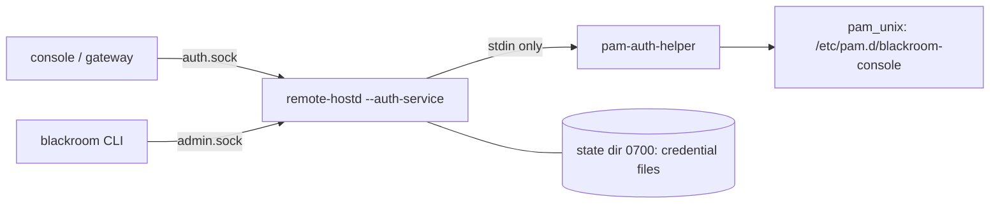

# Authentication (Phase 11)

How a remote login is decided. This describes what is built and tested; the limits are in
`threat-model.md` and the gate evidence is in `sec-gate-report.md`.

## What a login needs

| Client | Needs |
|---|---|
| New or untrusted | Linux password + authenticator code + **Remote Access Key** |
| Trusted device | Linux password + authenticator code + **device credential** |

No factor is optional and none stands in for another. A **recovery code** replaces only the
authenticator code, never the key or device. A trusted device never skips the authenticator code.
The three secrets are generated independently; none is derived from another (Doc 03 §5).

## Parts

- `remote-hostd --auth-service` (user unit `remote-hostd.service`, runs as you) owns the sessions,
  the security epoch, the rate limits and the audit log.
- `pam-auth-helper` (its own Cargo workspace, `crates/pam-auth-helper`, because the libpam bindings
  need libclang and their build script cannot share a build with the PipeWire bindings) is a separate
  one-shot executable. The password reaches it on standard input
  only (never an argument, environment variable, file or log) and it answers with an exit status.
  It runs as you and calls only PAM's authenticate stage (pam_unix's account stage needs root and refuses every
  correct password otherwise; password-expiry checks are therefore not done). `pam_unix` checks your own password through `unix_chkpwd`, so no privilege is
  needed and no password database is created.
- Two sockets in `$XDG_RUNTIME_DIR/blackroom-hostd/`, mode 0600, same-uid peers only:
  `auth.sock` (login, check, logout) and `admin.sock` (operator verbs).
- State directory (default `~/.local/share/blackroom-console/hostd`, mode 0700): all files 0600,
  written atomically by `blackroom-store`.

## Order of checks (`login.rs`)

1. Remote-access switch and emergency latch: closed means `REMOTE ACCESS DISABLED`, nothing else runs.
2. Well-formedness (garbage never touches a counter).
3. Rate limit: locked, or the tracking table is full, is refused **before** any password check.
4. Password via PAM, **outside the lock** that guards sessions and the epoch, so a login flood
   cannot delay `revoke-all` or `disable`. Everything up to here answers `AUTH_INVALID`, so account
   existence is not revealed.
5. Only now: missing authenticator code answers `AUTH_TOTP_REQUIRED`, missing key/device answers
   `AUTH_ACCESS_KEY_REQUIRED`.
6. Key or device is verified **before** the authenticator code, so a wrong key does not burn a code.
7. The authenticator code (or recovery code) is spent last; replay of a used step is refused and the
   spent step is persisted before success is reported.
8. Success opens an in-memory session bound to the security epoch (5 min, at most 5 live) and, if
   asked with the access key, registers a trusted device.

## Limits (numbers from Doc 03 and `blackroom-core::limits`)

- 5 failures per client and account in 15 minutes lock that pair for 15 minutes, doubling up to 4 h;
  10 failures per account lock the account for 15 minutes, doubling up to 24 h.
- Tracking tables are bounded (4096); when full, new names are refused before any password check.
- TOTP: RFC 6238, SHA-1, 6 digits, 30 s steps, one step of skew, each step usable once.

## Sessions, epoch, emergency

- A session token is 256 random bits, shown to its client once, held only in memory (a hostd restart
  ends every session). Operators see a separate 64-bit session id, which is not a credential.
- `revoke-all` and `disable` end all sessions and raise the persisted security epoch; the epoch never
  decreases and every start raises it again. An emergency stop (the offline marker) keeps remote
  access closed until local recovery clears it.
- Device revocation ends that device's live sessions at once (`revoke-device`).

## Not covered yet

- The console web app still logs in with its own TOTP-only mode (`--auth-dir`); wiring it to
  `auth.sock` is a later step. Until then use `blackroom login-check` to exercise the real chain.
- No browser-side flows (trust-this-device prompt, QR code) and no gateway; those are Phase 12+.
